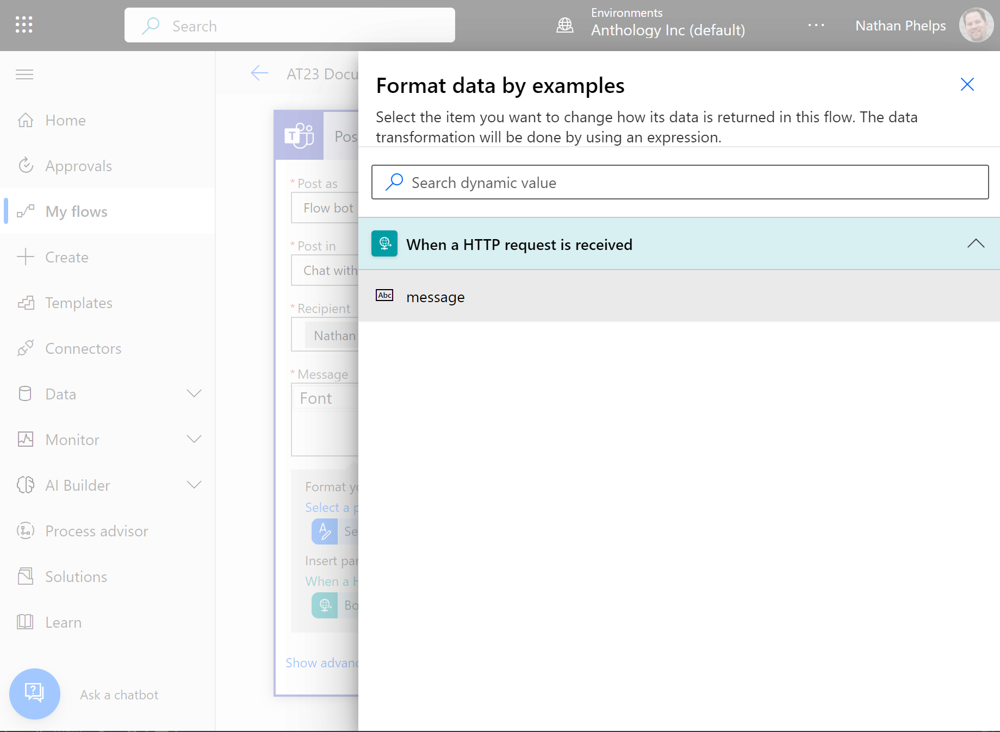

# Anthology Together 2023 Power Automate Workshop

This guide is designed to walk workshop participants through the various steps
of modeling a Power Automate workflow that communicates with Anthology Student
and Microsoft Teams. By the completion of the workshop, participants will have
completed a functional Power Automate workflow that can be initiated manually
or via the Anthology Student Workflow Engine. This workflow will accept parameters
which are used to query Anthology Student and initiate a approval workflow that
notifies a user via Microsoft Teams, prompts for their approval or disapproval, and then updates Anthology Student accordingly.

## Start by create a simple flow and testing it

We'll start by creating a very simple flow with an HTTP trigger and a single action which will post a message to Microsoft Teams. We are going to keep this flow purposely simple. Don't worry because we'll be adding complexity incrementally throughout the workshop.

1. In your browser navigate to https://make.powerautomate.com
2. Login using your credentials


3. Mouseover `New flow` and then choose `Instant Flow`
4. Name your flow AT23 Document Approval
5. Select the `When an HTTP request is received` trigger
6. Click `Create`


7. Click `New Step`
8. Enter in `post message` in the search box
9. Select the Microsoft Teams action named `Post message in chat or channel`


10. Select `Flow bot` form the `Choose Post` field
11. Select `Chat with Flow bot` in the `Post in` field
12. Enter in your email address in the `Recipient` field
13. Enter `Hello World!` in the `Message` field.


14. Open up the `When an HTTP request is received` step
15. Show `advanced options` and change the `Method` field to `GET`


16. Copy the URL
17. Save your flow
18. Test your flow by clicking on `Test`, hoosing `Manually`, and then clicking `Test`
19. Open a browser tab, paste in the HTTP URL and hit enter
20. Verify that you received a chat message in Teams
21. Verify that your flow completed successfully


## Enhance the simple flow to add parameters

Now we're going to make a simple change to our flow. Testing it will be a bit more complicated because we'll be making an HTTP Post instead of a simple GET. Thus, well need a tool like [Postman](https://www.postman.com/downloads/) to test it. If you don't have Postman installed, you'll want to do that first.

1. Click `Edit` to open up the flow.
2. Expand the `When an HTTP request is received` trigger
3. Go to the `advanced options` and change the `method` field to POST.
4. In the `Request Body JSON Schema` field enter in the following:

```json
{
    "type": "object",
    "properties": {
        "message": {
            "type": "string"
        }
    }
}
```
5. Expand the `Post a message in chat or channel` action
6. Remove `Hello World!` from the field
7. Choose `Select parameter`
8. Select the `message` parameter



9. Enter in `Hello World` and `Hello World` when prompted to give a format example
10. Click `Get expression` and click `Apply`
11. Save the flow
12. Create a new Postman collection by pasting the URL and choosing `POST` as the method.


13. Select the `Body` tab in the Postman request and choose the `raw` content type.
14. Past in the following JSON:

```json
{
    "message": "Hello from Anthology Together 2023!"
}
```


15. Back in Power Automate, manually Test your flow
16. In Postman click `Send`
17. Verify that you received a chat message in Teams that says `Hello from Anthology Together 2023!`
18. Verify that your flow completed successfully

## Add an approval to the flow
Now we are going to add a simple approval to the flow. The idea is to get the basic flow in place before we complicate things with Anthology Student.

1. Click `Edit` to open the flow in the designer
2. Click `+ New step` 
3. Enter `approval` in the search box
4. Select `Create an approval`


5. Select `Approve/Reject - First to respond` in the `Approval type` field
6. Enter `Approval Request` in the `Title` field
7. Enter your email address in the `Assigned to` field
8. Enter `Need Approval ASAP!` in the `Details` field


9. Click `+ New step` 
10. Enter 'approval' in the search box
11. Select `Wait for approval`
12. Select `Approval ID` in the `Approval ID` field


13. Test your flow, but this time choose `Automatically` and select `With a recenty used trigger`
14. Choose the most recently used successful trigger
15. Check Microsoft Teams for the approval and approve


## Add notification of approval outcome to flow
While the approval flow works as is, we're next going to add flow control to notify a user as to the outcome of the approval.

1. Click `Edit` to open the flow in the designer
2. Click `+ New step` 
3. Select `Control` and then select `Condition`


4. Select `Outcome`, `is equal to` and Select `Approve` for the value


5. Scroll down to the `Yes` condition and click `Add an action`
6. Choose Teams and then select `Post message in chat or channel` just like we did previously.


7. Use the same configuration for this step as well, execpt in the `Message` field select `Response summary` and then enter in the text `APPROVAL COMMENTS` and select `Responses Comments`


8. Scroll down to the `No` condition and apply the same configuration as you did for `Yes` except in the `Message` field replace `APPROVAL COMMENTS` with `REJECTION COMMENTS`


9. Test your flow, but this time choose `Automatically` and select `With a recenty used trigger`
10. Choose the most recently used successful trigger
11. Check Microsoft Teams for the approval and approve/reject adding a comment
12. Verify that you received a Teams message with the correct accept/reject message

## Adding Anthology Student Connector
We now have a basic flow with a HTTP trigger, an initial notification, an approval workflow and a notification of the outcome of that workflow. We will now begin to add API calls to Anthology Student via a `Connector`.

1. Navigation to `Data` > `Custom Connectors`
2. Click `+ New custom connector` > `Import an OpenAPI file`
3. Name the custom connector `AT23 Anthology Student` and import the the OpenAPI file from [anthology-student-connector.json](resources/anthology-student-connector.json)


4. Accept the defaults on the `General information` screen and click `Security ->` at the bottom of the screen


5. Accept the defaults on the Security screen and click `Definition ->`
6. Click the Check at the top of the screen to save the custom connection


7. Now we are prepared to use this custom connection in our Flow.