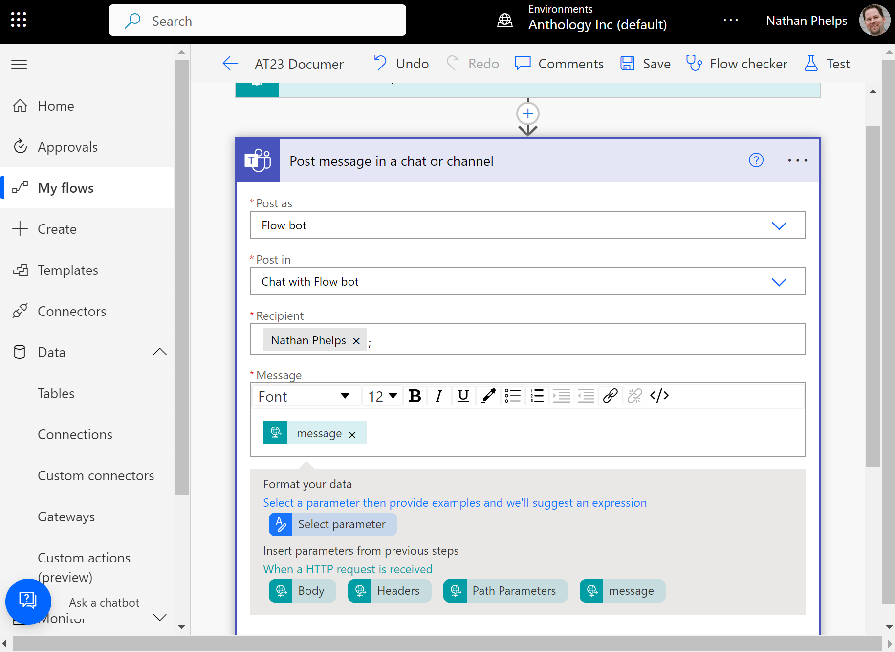
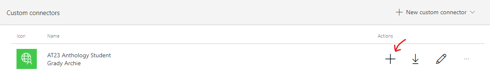
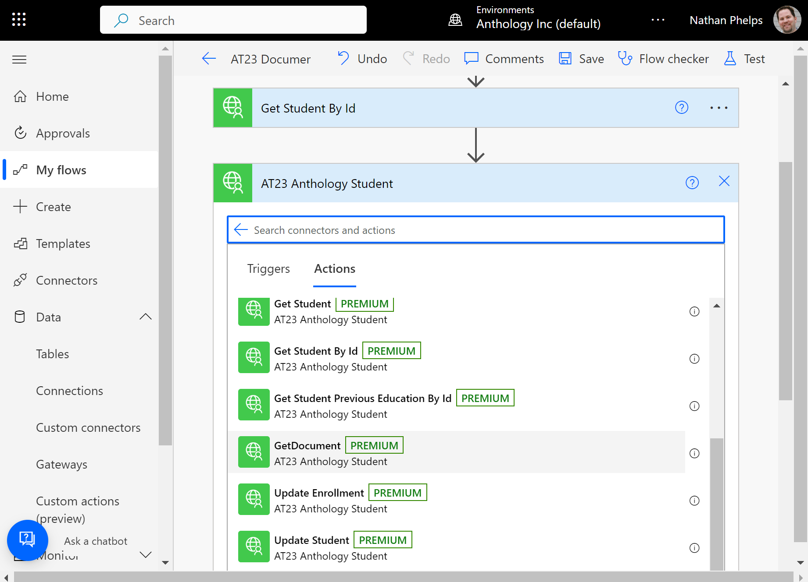

# Anthology Together 2023 Power Automate Workshop

This guide is designed to walk workshop participants through the various steps
of modeling a Power Automate workflow that communicates with Anthology Student
and Microsoft Teams. By the completion of the workshop, participants will have
a functional Power Automate workflow that can be initiated via an HTTP Trigger 
( which can be invoked via the Anthology Student Workflow Engine). This workflow will accept parameters that are used to query Anthology Student and initiate a approval workflow that notifies a user via Microsoft Teams, prompts for their approval or disapproval, and then updates Anthology Student accordingly.

### What you will need
In order to participate in this workshop participants will need an Azure tenet  with Power Automate and Microsoft Teams. Participants will also need software (either command line or other) capable of sending HTTP POST request to URLs. We will be using [Postman](https://www.postman.com/downloads/) thoughout this guide.

---

## Start by creating a simple flow and testing it

We will start by creating a very simple flow with an `HTTP Trigger` and a single action that will post a message to Microsoft Teams. We are going to keep this flow purposely simple. We will be adding complexity incrementally throughout the workshop.

1. In your browser navigate to https://make.powerautomate.com
2. Login using your credentials


3. Mouseover `New flow` and then choose `Instant Cloud Flow`
4. Name your flow "AT23 Document Approval"
5. Select the `When an HTTP request is received` trigger
6. Click `Create`


7. Click `New Step`
8. Enter in `post message` in the search box
9. Select the Microsoft Teams action named `Post message in chat or channel`


10. Select `Flow bot` from the `Choose Post` field
11. Select `Chat with Flow bot` in the `Post in` field
12. Enter in your tenet email address in the `Recipient` field
    (Use a recepient in your sandbox or target environment)
13. Enter `Hello World!` in the `Message` field.


14. Open up the `When an HTTP request is received` step
15. Show `advanced options` and change the `Method` field to `GET`


16. Save your flow
17. Copy the URL from the `HTTP Trigger`
18. Test your flow by clicking on `Test`, choosing `Manually`, and then clicking `Test`
19. Open a browser tab, paste in the HTTP URL and hit enter
20. Verify that you received a chat message in Teams
21. Verify that your flow completed successfully


---


---

## Enhance the simple flow to add parameters

Now we're going to make a simple change to our flow. Testing it will be a bit more complicated because we'll be making an HTTP Post instead of a simple GET. Thus, we need a tool like [Postman](https://www.postman.com/downloads/) to test it. If you don't have Postman installed, you'll want to do that first.

1. Click `Edit` to open up the flow.
2. Expand the `When an HTTP request is received` trigger
3. Go to the `advanced options` and change the `method` field to POST.
4. In the `Request Body JSON Schema` field enter in the following:

```json
{
    "type": "object",
    "properties": {
        "message": {
            "type": "string"
        }
    }
}
```
5. Expand the `Post a message in chat or channel` action
6. Remove `Hello World!` from the field
8. Select the `message` parameter



9. Save the flow
10. In Postman (or a tool of your choice) pastie the URL and choose `POST` as the method.


11. Select the `Body` tab in the Postman request and choose the `raw` content type.
12. Past in the following JSON:

```json
{
    "message": "Hello from Anthology Together 2023!"
}
```


13. Back in Power Automate, manually Test your flow
14. In Postman click `Send`
15. Verify that you received a chat message in Teams that says `Hello from Anthology Together 2023!`
16. Verify that your flow completed successfully
---


---

## Add an approval to the flow
Now we are going to add a simple approval to the flow. The idea is to get the basic flow in place before we complicate things with Anthology Student API calls.

1. Click `Edit` to open the flow in the designer
2. Click `+ New step` 
3. Enter `approval` in the search box
4. Select `Start and wait for approval`


5. Select `Approve/Reject - First to respond` in the `Approval type` field
6. Enter `Approval Requested` in the `Title` field
7. Enter your email address in the `Assigned to` field
8. Enter `Approval Required ASAP` in the `Details` field


9. Save the flow
10. Test your flow, but this time choose `Automatically` and select `With a recently used trigger`
11. Choose the most recently used successful trigger
12. Check Microsoft Teams for the approval and approve


13. Verify that the flow completed successfully

---

## Add notification of approval outcome to flow
While the approval flow works as is, we're next going to add flow control to notify a user as to the outcome of the approval.

1. Click `Edit` to open the flow in the designer
2. Click `+ New step` 
3. Select `Control` and then select `Condition`


4. Select `Outcome`, `is equal to` and Select `Approve` for the value


5. Scroll down to the `Yes` condition and click `Add an action`
6. Choose Teams and then select `Post message in chat or channel` just like we did previously.


7. Use the same configuration for this step as well, except in the `Message` field select `Response summary` and then enter in the text `APPROVAL COMMENTS` and select `Responses Comments`


8. Repeate step #7 for the `No` condition and apply the same configuration as you did for `Yes` except in the `Message` field replace `APPROVAL COMMENTS` with `REJECTION COMMENTS`


9. Save the flow
10. Test your flow, but this time choose `Automatically` and select `With a recently used trigger`
11. Choose the most recently used successful trigger
12. Check Microsoft Teams for the approval and approve/reject adding a comment
13. Verify that you received a Teams message with the correct accept/reject message
14. Verify that the flow completed successfully
---

## Add Anthology Student Connector
We now have a basic flow with an HTTP trigger, an debug notification, an approval workflow, and a notification of the outcome of that workflow. We will now begin to add API calls to Anthology Student via a `Connector`.

1. Navigate to `Data` > `Custom Connectors`
2. Click `+ New custom connector` > `Import an OpenAPI file`
3. Name the custom connector `AT23 Anthology Student` and import the OpenAPI file from [anthology-student-connector.json](resources/anthology-student-connector.json)


4. Accept all of the defaults on the import wizzard and click the check at the top of the screen to save the custom connector

5. Once it is saved, click "Close" to exit this connector

---

## Add Anthology Student Connection
Now that we have defined a `Connector`, we need to configure a `Connection` based on this connector.

1. Navigate to `Data` > `Custom Connectors`

2. Click `+` next to the `AT23 Anthology Student` connector



3. Copy and paste the following value in the `API key` input field


`ApplicationKey eyJDYWxsaW5nQXBwTmFtZSI6IktsYXVzIiwiS2V5VmFsdWUiOiJPZ2RjYnRiTUJCblhQWElTUldiNlJRPT0ifQ==`

4. Click `Create Connection`


---

## Setup test data in Anthology Student
Before we can invoke the Anthology Student APIs we need to login to Anthology Student and create a test document.

1. Navigate to https://sisclientweb-900188.campusnexus.dev
2. Login using the credentials you were provided
3. When prompted to select a default campus select the `Eastlake` campus
4. avigate to the `Student` List.


5. Select any student in the list
6. In the `Student Profile` expand `Contact Manager` and select `Documents`


7. Click `+ New Document`
8. Select `System` for the value of the `Module` field
9. Select `AT23 Document` for the value of the `Document` field
10. Accept the defaults for all other fields
11. Click `Save`
12. Expand the URL and make note of the Student and Document Ids


---

## Modify the input schema and test the output
Having setup our test data in Anthology Student, we can now start to add the actions to invoke Anthology Student APIs. First, however, we need to modify the JSON schema so that we can use the input parameters in our flow and test to make sure the parameters are being properly posted.

1. Edit the flow, and then expand the `When a HTTP request is received` trigger
2. Remove the `message` parameter from the `JSON Schema`.
3. Add two new properties to the `JSON Schema`: An `integer` named `studentId` and an `integer` named `documentId`.


Your completed JSON Schema should look like this:

```json
{
    "type": "object",
    "properties": {
        "studentId": {
            "type": "integer"
        },
        "documentId": {
            "type": "integer"
        }
    }
}
```

4. Update the `Post message in chat or channel` action to remove the `message` from the `Message` field.
5. Save the flow (this is required for us to access the new parameters)
6. Update the `Message` field to include the new parameters we added to the `JSON Schema`, `studentId`, and `documentId`.


7. Save the flow
8. Since we changed the `JSON Schema` we need to go back to `Postman` and update the request body to include those fields. Use the values from Anthology Student that you made note of above


9. Test the flow `Manually` (because the posted data has changed) and submit the API call via Postman to initiate the HTTP `POST`
10. Verify that the message you received in Microsoft Teams includes the appropriate `studentId` and `documentId`
11. Verify that the approval flow works as it did previously

---

## Add Anthology Student API calls

Now that the JSON schema has been updated and tested, we can add Anthology Student API calls which will make use of these parameters.

1. Insert a new step after the `Post message in chat or channel` action
2. Select `Custom` and then choose the `AT23 Anthology Student` connector
3. Select the `Get Student By Id` operation


4. Select the `studentId` parameter for the `id` field


5. Insert a new step after the `Get Student By Id` action
6. Select `Custom` and then choose the `AT23 Anthology Student` connector
7. Select the `Get Document` operation



8. Select the `documentId` parameter for the `id` field


9. Save the flow
10. Verify it looks like this:


---

## Use data from the Anthology Student API Calls
Having added Anthology Student API calls to the flow, we now need to ensure that they really work. We'll start with some simple variables which will be populated from the returned API data. We'll then use these variables in the Microsoft Teams approval workflow.

1. Click `Insert a new step` after the `Get Document` step
2. Type in `var` in the search box and then select `Initialize variable`


3. Enter `URL` in the `Name` field
4. Select `string` in the `Type` field 
5. Enter `https://sisclientweb-900188.campusnexus.dev/` in the `Value` field


6. Repeat the above instructions to add a new `Initialize variable` step below the `URL` variable
7. Enter `Link` in the `Name` field
8. Select `string` in the `Type` field
9. Use the `URL` variable, the `studentId` parameter, and the `documentId` parameter to construct the link to the Student Document in Anthology Student.


10. Repeat the above instructions to add a new `Initialize variable` step below the `Link` variable
11. Enter `Name` in the `Name` field
12. Select `string` in the `Type` field
13. In the value field enter the following expression:

```javascript
concat(body('Get_Student_By_Id')['payload/data']['FirstName'],' ',body('Get_Student_By_Id')['payload/data']['LastName'])
```

14. Expand the `Start and wait for approval` step
15. Update the `Details` field to include the `Name` variable
16. Update the `Item link` field with the `Link` variable
17. Update the `Item link description` field with the text `Go to student document`


18. Save the flow
19. Test your flow `Automatically` and select `With a recently used trigger`
20. Choose the most recently used successful trigger
21. Verify that the approval request includes the appropriate values from the Anthology Student API requests


---

## Update Anthology Student via the API based on the approval workflow
Now we get to close the loop! Based on the result of the approval, we are going to update Anthology Student via the API to change the status of the document.

1. Expand the Condition step and then expand the `Apply to` step  in the `If yes` block


2. Click `Add an action` after the `Post message in chat or channel` action
3. Choose `Custom`, select `AT23 Anthology Student`, then choose `Update Student Document`


4. Select `Completion Date` for the `approvedDate` field
5. Select `Response Comments` for the `note` field
6. Enter `11` for the `documentStatusId` field (this is the Id for `Approved`)
7. Map all the remaining fields to the `Document` instance retrieved via the API previously using the following expression:

```javascript
outputs('GetDocument')?['body/payload/data/<FIELDNAMEHERE>']
```


8. Repeat the steps above for `Denied` using `12` for the `documentStatusId` field
9. Test the flow
10. Verify that the appropriate Document was updated in Anthology Student accordingly


## Congratulations, you have completed the Workshop!